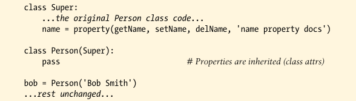

# Properties 

The property protocol allows us to route a specific attribute's get, set and delete operations to functions or methods we provide. enabling us to insert code to be run automatically on attribute access, intercept attribute deletions, and provide documentation for the attributes if desired.

Properties are created with the **property** built-in and are assigned to class attributes, just like method functions. Accordingly, they are inherited by subclasses and instances, like any other class attributes. Their access-interception functions are provided with the **self** instance argument, which grants access to state information and class attributes available on the subject instance.


A property manages a single, specific attribute; it allows us to control both fetch and assignment accesses and enables us to change an attribute from simple data to a computation freely, without breaking existing code.


### The Baisc


A property is created by assigning the result of a built-in function to a class attribute:

```py
attribute = property(fget, fset, fdel, doc)
```

None of this built-in's arguments are required, and all default to **None** if not passed. For the first three, this **None** means that the corresponding operation is not supported, and attempting it will raise an **AttributeError** exception automatically.

When these argumens are used:

- **fget**: a function for intercepting attributes fetches.
- **fset**: a function for assignmetns.
- **fdel**: a function for attribute deletions.
- **doc**: argument receives a documentation string for the attribute, if desired; otherwise, the property copies the docstring of the **fget** function, which as usual defaults to **None**.


### A First Example

```py
class Person:
    def __init__(self, name):
        self._name = name 

    def getName(self):
        print("fetch...")
        return self._name
    
    def setName(self, value):
        print("change...")
        self._name = value 
    
    def delName(self):
        print('remove...')
        del self._name 

    name = property(getName, setName, delName, "name property docs")


def main():
    bob = Person("Bob Smith")
    print(bob.name)
    bob.name = "Robert Smith"
    print(bob.name)
    del bob.name 

    print("-"*20)
    sue = Person("Sue Jones")
    print(sue.name)
    print(Person.name.__doc__)

if __name__ == "__main__":
    main()
```

```bash
fetch...
Bob Smith
change...
fetch...
Robert Smith
remove...
--------------------
fetch...
Sue Jones
name property docs
```

----------

Like all class attributes, properties are *inheritences* by both instances and lower subclasses. If we change our example as follows, for instance:



the output is the same--the **Person** subclass inherits the **name** property from **Super**, and the **bob** instance gets it from **Person**.


[text](https://)