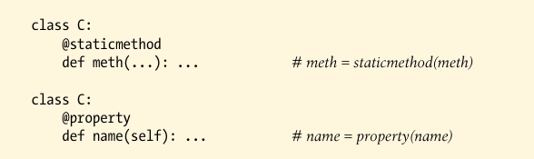

# Function Decorators

## Usage

A function decroator is a kind of *runtime declaration* about the function whose defintion follows. The decorator is coded on a line just before the **def** statement that defines a function or method, and it consists of the @ symbol followed by a reference to a *metafunction*--a function (or other callable object) that manages another function:

Function decorators automatically map the following syntax:


into this equivalent form, where **decorator** is a one-argument callable object that returns a callable object with the same number of arguments as F (in not F itself):


This automatic name rebinding works on any **def** statement, whether it's for a simple function or a method within a class. When the function F is later called, it's actually calling the object *returned* by the decorator, which my be either another object that implements required wrapping logic, or the original function itself.

Decoration essentially maps the first of the following into the second--though the decorator is really run only once, at decoration time.

```
funcion(6, 7)
decorator(func)(6, 7)
```

This automatic name rebinding accounts for the static method and property decoration syntax:




In both cases, the method name is rebound to the result of a built-in function decorator, at the end of the **def** statement. Calling the original name later invokes whatever object the decorator returns.

### Implementation

A decorator itself is a *callable that returns a callable*. That is, it returns the object to be called later when the decorated function is invoked throught its original name--eight a wrapper object to intercept later calls, or the original function argumented in some way.

Decorators can be any type of callable and *return* any type of callable: any combination of function and classes may be used.

```py
In [1]: def decorator(F):
   ...:     # process function F
   ...:     return F
   ...: 

In [2]: @decorator
   ...: def func(): ...             # func = decoration(func)

In [3]: func()

In [4]: 
```

Because the original decorated function is assigned back to its name, this simply adds a post-creation step to function definition. Such a structure might be used to register a function to an API, assign function attributes, and so on.

----------


We might code a decorator to return a different object then the original function--a proxy for later calls:


This decorator is invoked at decoration time, and the callable it returns is invoked when the original function name is later called. The decorator itself receives the decorated function; the callable returned receives whatever arguments are later passed to the decorated function's name. When coded properly, this works the same for class-level *methods*: the implied instance object simply shows up in the first argument of the returned callabled.

Here's one common coding pattern that captures this idea--the decorator returns a wrapper that retains the original function in an enclosing scope.


When the name **func** is later called, it really invokes the **wrapper** function returne by **decoator**; the **wrapper** function canthen run the original **func** because it is still avaiable in an *enclosing scope*. When coded this way, each decoratod function produces a new scope to retain state.

To do the same with classes, we  can overload the call operation and use instance attributes instead of enclosing scopes:


----------

### Suporting method decoration

One suble point about the prior class-based coding is that while it works to intercept simple *function* calls, it does not quite work when applied to class-level *method* functions:


when coded tihs way, the decorated method is rebound to an instance of the decorator class, instead of a simple function.

The problem with this is that the **self** in the decorator's `__call__` receives the **decorator** class instance when the method is later run, and the instance of class C is never included in ***args**. This makes it impossible to dispatch the call to the orignal method-the decorator object retains the original method functino, but it has no instance to pass to it.

----------

To support *both* function and methods, the nested function alternative works better:


When coded they way **wrapper** receives the **C** class instance in its first argument, so it can dispatch to the original method and access state information.