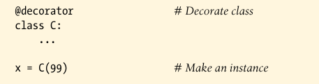
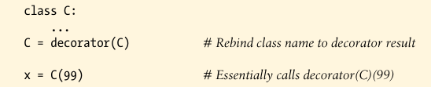
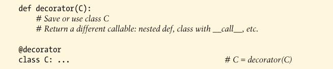

# Class Decorators

Class decorators are strongly related to function decorators; in fact, they use the same syntax and very similar coding patterns. Rather then wrapping individual functions or methods, though, class decorators are a way to manage classes, or wraps up instance construction calls with extra logic that manges or augments instances created from a class.

### Usage



is equivalent to the following--the class is automatically passed to the decorator function, and the decorator's result is assigned back to the class name:




The net effect isthat calling the class name later to create an instance winds up triggering the callable returned by the decorator, which may or may not call the original class itself.

----------

### Implementation

class decorators are coded with many of the same techniques used for function decorators, though some may involve *two levels* of augmentation--to manage both instance construction calls, as well as instance interface access. Because the class decorator is also a *callable that returns a callable*, most combinations of functions and classes suffice.

To simply manage a class just after it is created, return the orignal class itself:

```py

In [4]: def decorator(C):
   ...:     # Process class C
   ...:     return C
   ...: 

In [5]: @decorator
   ...: class C: ...                  # C = decorator(C)

```

Io instead insert a wrapper layer that intercepts later instance creation calls, return a different callable object:



The callable returned by such as class decorator typically creates and returns a new instance of the original class, augment in some way to manage its interface. For example, the following inserts an object that intercepts undefined attributes of a class instance:

```py
def decorator(cls):                                 # On @ decoration
    class Wrapper:
        def __init__(self, *args):                  # On instance creation
            self.wrapped = cls(*args)
        def __getattr__(self, name):                # On attribute fetch
            return getattr(self.wrapped, name)
    return Wrapper

@decorator
class C:                                            # C = decorator(C)
    def __init__(self, x, y) -> None:               # Run by Wrapper.__init__
        self.attr = "spam"

x = C(6, 7)                         # Really calls Wrapper(6, 7)
print(x.attr)                       # Runs Wrapper.__getattr__, prints "spam" 
```

In this example, the decorator rebinds the class name to another class, which  retains the original class in an enclosing scope and creates and embeds an instance of the original class when it’s called. When an attribute is later fetched from the instance, it is intercepted by the wrapper’s `__getattr__` and delegated to the embedded instance of the original class. Moreover, each decorated class creates a new scope, which remembers the original class.

Like function decorators, class decorators are commonly coded as either "factory" functions that create and returns callables, classes that use `__init__` or `__call__` methods to intercepts call operations, or some combination thereof. Factory function typically retain state in enclosing scope references, and classes in attributes.

----------

### Supporting mulitple instances

Consider the following invalid alternative to the clas decorator of the prior example:

```py
class Decorator:
    def __init__(self, C):                          # On @ decoration
        self.C = C 
    def __call__(self, *args):                      # On instance creation
        self.wrapped = self.C(*args)
        return self 
    def __getattr__(self, attrname):                # On attribute fetch
        return getattr(self.wrapped, attrname)
    
@Decorator
class C: ...                            # C = Decorator(C)

x = C()
y = C()                                 # Overwrites x!
```

This code handles mulitple decorated classes (each makes a new **Decorator** instance) and will intercept instance creation c alls (each run `__call__`).

This version fails to handle *multiple instances* of a given class--each instance creation call overwrites the prior saved instance.  

The original version does support mulitple instances, because each instance creation call makes a new independent wrapper object. More generally, either of the following patterns supports mulitple wrapped instances:

```py
def decorator(C):                       # On @ decoration
    class Wrapper:
        def __init__(self, *args):      # On instance creation: new Wrapper
            self.wrapped = C(*args)     # Embed instance in instance
    return Wrapper

class Wrapper: ...
def decorator(C):                       # On @ decoration
    def onCall(*args):                  # On instance creation: new Wrapper
        return Wrapper(C(*args))        # Embed instance in instance
    return onCall
```