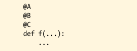
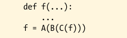
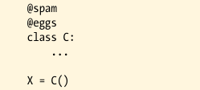
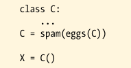
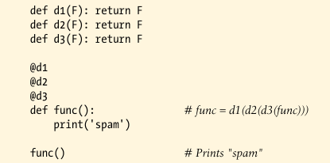
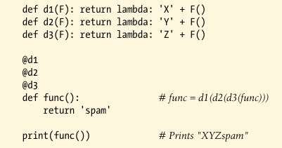

# Decorator Nesting

Sometimes one decorator isn't enough. 

To support multiple nested steps of augmentation this way, decorator syntax allows you to add multiple layers of wrapper logic to a decorated function function or method. When this feature is used, each decorator musst appear on a line of its own. Decorator syntax of this form:

runs the same as the following:

Here, the original function is passed through three, different decorators, and the resulting callable object is assigned back to the original name. Each decorators processes the result of the prior, which may be the original function or an inserted wrapper.

If all the decorators insert wrappers, the net effect is that when the original function name is called, three different layers of wrapping object logic will be invoked, to augment the original function in three different ways. The last decorator listed is the first applied, and is the most deeply nested when the orignal function name is layer called.

----------

Just as for functions, mulitple class decorator result in multiple nested function calls, and possibly mulitple levels and steps of wrapper logic around instance creation calls. For example, the following code:

is equivalent to the following:

----------

For instance the following do-nothing decorators simply return the decorated function:

The same syntax works on classes, as do these same do-nothing decorators.

When decorators insert wrapper function objcts, though, they may augment the original function when called--the following concatenates to its result in the decorator layers, as it runs the layers from inner to outer:

