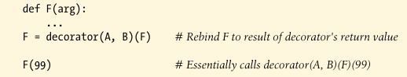

# Decorator Arguments

Both function and class decorators can also seem to take *augments*, although really these aguments are passed to a callable that in effect *returns* the decorators, which in turn returns a callable. By nature, this usually sets up mulitple levels of state retention.

The follow, for instance:


is automatically mapped into this equivalent form, where **decorator** is a callable that *returns* the actual deorator. The returned decorator in turn returns the callable run later for calls to the original function name:



Decorator arguments are resolved before decoration ever occrus, and they are usually used to retain state information for use in later calls. the decoration function in this example, for instance might take a form like the following:


The outer function in this structure generally saves the decorator arguments away as state information, for use in the actual decorator, the callable it returns, or both. This code snippet retains the state information argument in enclosing function scope references, but class attributes are commonly used as well.

In other words, decorator arguments often imply *three levels of callables*: a callable to accept decorator arguments, which returns a callable to serve as decorator, which returns a callable to handle calls to the original function or class. Each of the three levels may be a function or class and may retain state in the form of scopes or class attributes.


### Decorators Manages Functions and Classes, Too

Decorator is a protocol for passing functions and classes through any callable immediately after they are created. As such, it can also be used to invoke arbitrary postcreation processing.

```py
def decorator(O):
    # Save or augment function or class O
    return O

@decorator
def F(): ...            # F = decorator(F)

@decorator
class C: ...            # C = decorator(C)
```

As long as we return the original decorated object this way instead of a proxy, we can manage functions and classes themselves.