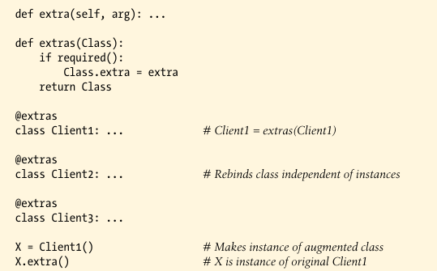

# Metaclasses Versus Class Decorators: Round 1

Suppose we coded our manager function to return the augmented class, instead of simply modifying it in place. This would allow a greater degree of flexibility, because the manager would be free to return any type of object that implements the class's expected interface:

We can use class decorator's role in augmenting *instance* creation calls. That is, class decorators can apply extra logic to classes, not just *instances*, at class creation time:

Decorator essentially automate the prior's example mannual name rebinding here. Just as for metaclasses, because this decorator returns the original class, instances are made from it, not from a wrapper object. In fact, instance creation is not intercepted at all in above case.

Decorators can be used to manage both instances and classes, and intersect most strongly with metaclass in the second of these roles

Decorators technically corresponding to metaclass `__init__` methods, used to instialize newly created class. Metaclasses have addition customization hooks beyound class initialization,  though, and may perform arbitrary class construction taks that might be more difficult with decorators. This can make them more complex but also better suited for augmenting classes as they are being formed.

For example, metaclasses also have a `__new__` method used to create a class, which has no analogy in decorators; makeing a new class in a decorator would inccur an extra stop. Moreover, metaclasses may also provided behavior acquired by classes in the form of *methods*, which have no direct counterpart in decorators either; decorators must provide class behavior is less direct ways.