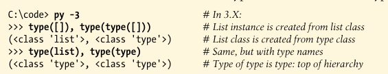

# The Metaclass Model

### Class are Instances of type

In Python 3.X, user-defined class objects are instances of the object name **type**, which itself a class.

The **type** built-in returns the type of any object when call with a single argument. For built-in types like lists, the type of the instance is the built-in type, but the type of the list type is the type **type** itself--the **type** object at the top of the hierarchy creates specifics types, and specific types creates instances.



```py

In [1]: type([]), type(type([]))
Out[1]: (list, type)

In [2]: type(list)
Out[2]: type

In [3]: type(type)
Out[3]: type

In [4]: 
```

The type/instance relationship holds true for user-defined classes: instances are created from classes, and classes are created from **type**. In Python 3.X, though, the notion of a "type" is merged with the notion of a "class".  In fact, the two are essentially synonyms--*classes are types, and types are classes*. That is:

- Types are defined by classes that derive from type.
- User-defined classes are instances of type classes.
- User-defined classes are types that generate instances of their own.


All user-defined classes in 3.X are instances of the **type** classes, and instance objects are instances of their classes; in fact, classes now have a `__class__` that links to **type**, just as an instance has a `__class__` that links to the class from which it has made:

```py

In [4]: class C: pass           # 3.X class object (new-style)

In [5]: X = C()                 # Class intance object

In [6]: type(X)                 # Instance is instance of data
Out[6]: __main__.C

In [7]: X.__class__             # Instance's class
Out[7]: __main__.C

In [8]: type(C)                 # Class is instance of type
Out[8]: type

In [9]: C.__class__             # Class's class is type
Out[9]: type

In [10]: 
```

Notice especiall that las two lines here--classes are instances of the **type** class, just as normal instances are instances of a user-defined class. This works same for both built-ins and user-defined class. This works the same for both built-ins and user-defined class types in 3.X. In fact, classes are not really a separate concept at all, they are simply user-defined types, and **type** itself is defined by a class.


### Metaclasses are Subclasses of Type

Classes are really instances of the **type** class, creating classes from customized subclasses of type allows us to implement custom kinds of classes.

- **type** is a class that generates user-defined classes.
- Metaclasses are subclasses of the **type** class.
- Class objects are instances of the **type** class, or a subclass thereof.
- Instance objects are generated from a class.

In other words, to control the way classes are created and augment their behavior, all we need to do is specify that a user-defined class be created from a user-defined metaclass instead of the normal **type** class.


### Class Statement Protocol

Python calls the **type** object to create that **class** object like this:

```py
class = type(classname, superclasses, attributedict)
```

The **type** object in turn defines a `__call__` operator overloading method that runs two other methods when the type object is called:

```py
type.__new__(typeclass, classname, superclasses, attributedict)
type.__init__(class, classname, superclasses, attributedict)
```

the `__new__` method creates and returns the new **class** object, and then the `__init__` method initializes the newly created object. These are the hooks that metaclass subclasses of the type generally use to customize classes.

For example, given a class definition like the following for **Spam**:

```py
class Eggs:                         # Inherited names here
    ...

class Spam(Eggs):                   # Inherits from Eggs
    data = 1                        # Class data attribute
    def meth(self, arg):            # Class method attribute
        return self.data + arg
```

Python will internally run the nested code block to create two attributes of the class (**data** and **meth**), and then call the **type** object to generate the **c**lass object at the end of the **class** statement:

```py
Spam = type("Spam", ("Eggs", ), {"data": 1, "meth": meth, "__module__": "__main__"})
```

In fact, you can call **type** this way yourself to create a class dynamically

```py
In [14]: x = type("Spam", (), {"data": 1, "meth": (lambda x, y: x.data + y)})

In [19]: i = x()

In [21]: x, i
Out[21]: (__main__.Spam, <__main__.Spam at 0x7feaaa1494b0>)

In [22]: i.data, i.meth(2)
Out[22]: (1, 3)

In [5]: x.__name__
Out[5]: 'Spam'


```

The class produced is exactly like that you'd get from running a *class* statement:

```py
In [2]: x.__bases__
Out[2]: (object,)

In [4]: [(a, v) for (a, v) in x.__dict__.items() if not a.startswith("_")]
Out[4]: [('data', 1), ('meth', <function __main__.<lambda>(x, y)>)]

In [5]: 
```